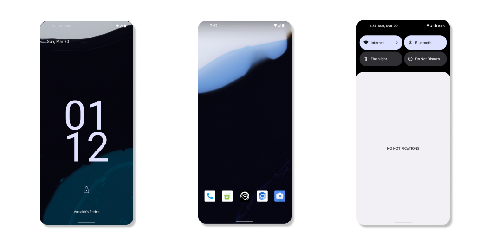
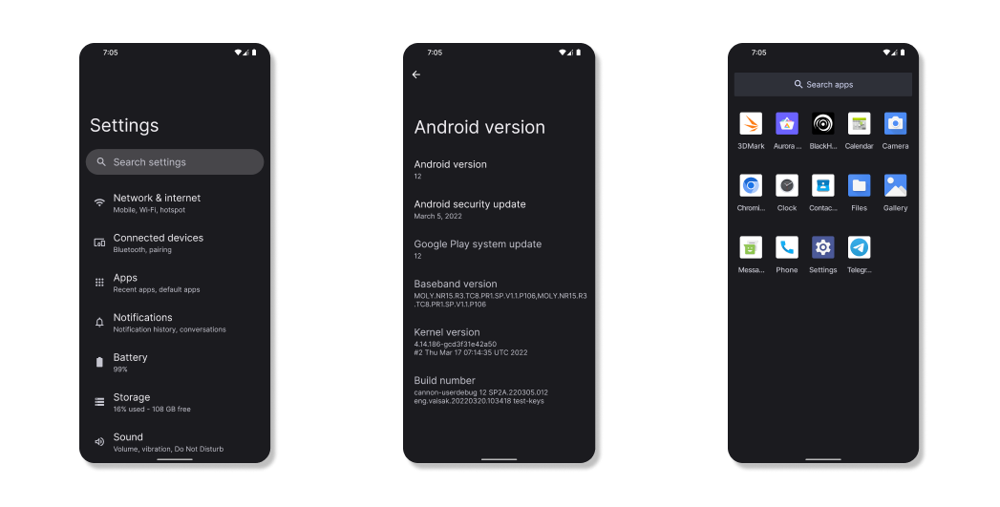

# AOSP on Cannon Releases
Download AOSP on Cannon from here!

[Head over to the releases page to download the latest build!](https://github.com/AOSP-on-Cannon/releases/releases)

## Changelogs

### Release 1
* Initial release
* No google apps
* GrapheneOS Camera
* Chromium browser
* Inter font as the default System font
* Clean Pure AOSP UI
* Launcher without the ugly quicksearchbox on home
* Double tap to sleep on Launcher

### Release 2
* Android 12.1.0_r4 (April 2022 Security Patch)
* Fixed WebView issues
* Fixed inter font weights
* Enable Microphone and Camera disabling Quick toggles
* Reduce further debugging on ART, System Server, Java and Dex (Only available on user builds)
* Default Squircle icon shape
* Accent colour changes to AOSP Keyboard

Device Specific:
* Remove unneeded libs
* Metadata partition corruption protection
* Reduce logspam from MTK userspace blobs
* Fixed Display panel colour modes
* Improved UI response
* Entire C code is now optimised with armv8-2a-dotprod.
* Updated blobs from MIUI V12.5.8 RJEMIXM
* Kernel upstreamed to Linux LTS release (4.14.275).

### Release 3
* May Security Patch.

Device Specific:
* Fixed all crashing issues on Chinese variants.
* Fixed fingerprint on Chinese variants.
* Fixed Secure element spam.
* Kernel upstreamed to 4.14.276.
* Massive performance improvements.

## Screenshots
### Screenshots are from AOSP on Cannon Release 1
 

